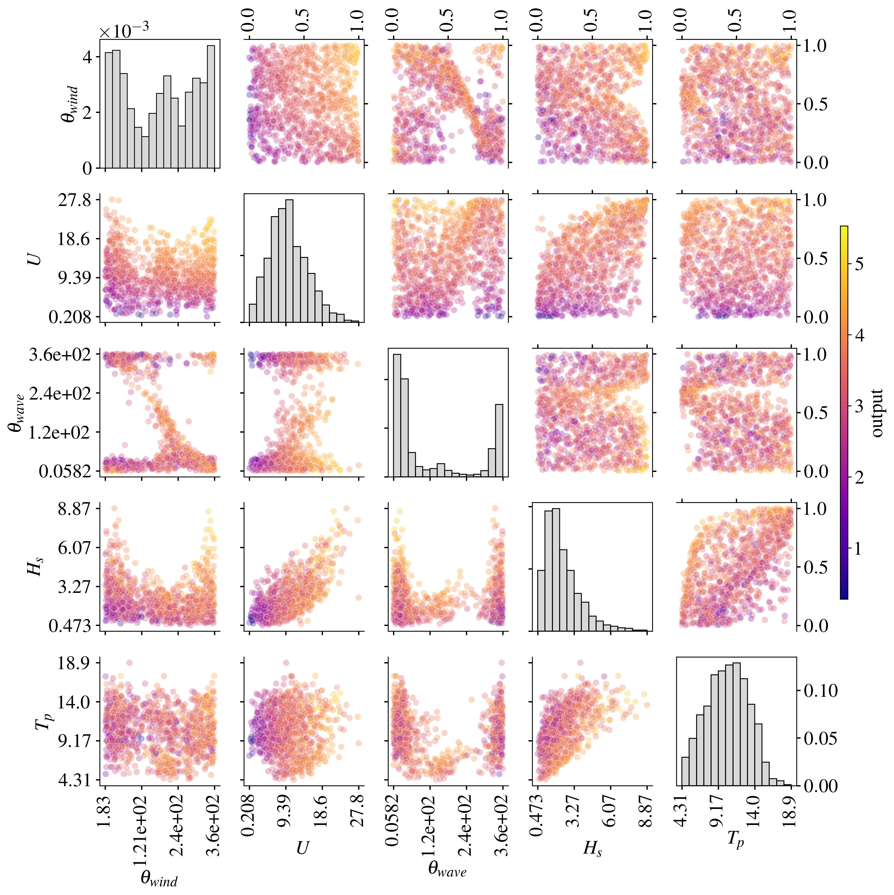
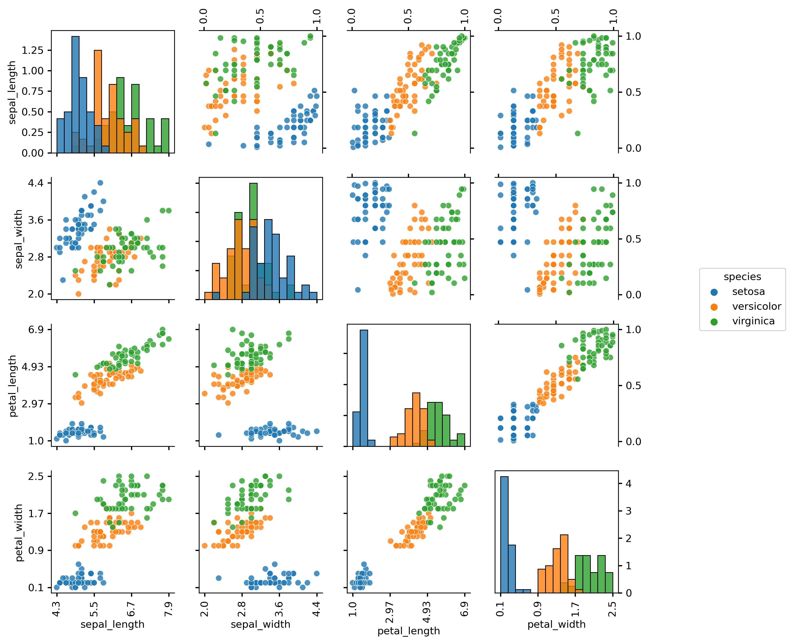
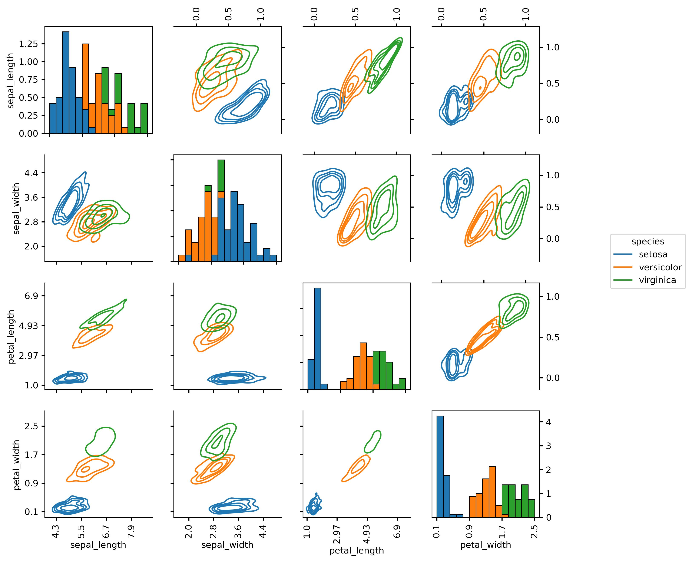

# Copulogram

This package is provides a new data visualisation tool to explore multivariate datasets developped with V.Chabridon. 

A *copulogram* is an innovative plot as it decomposes a mutivariate dataset between the effects of the marginals and those of the dependence between features. To do so, it represents the marginals with univariate kernel density estimation plots or histograms (diagonal), and the dependence structure with scatter plots in the ranked space (upper triangle). On the bottom triangle the scatter plots are set in the physical space, gathering the effects of the marginals and the dependencies. Since the dependence structure is theoretically modeled by an underlying copula, this plot is called *copulogram*, generalizing the well-known ``correlogram'' to nonlinear dependencies. It gives a synthetic and empirical decomposition of the dataset.


## Copulogram of a wind-wave dataset




## Installation 

The following commands install the current version of the copulogram package.
```
~$ pip install copulogram
```

## Example on iris dataset

Using the famous [iris dataset](https://en.wikipedia.org/wiki/Iris_flower_data_set), let us plot copulograms with different settings: 


```
>>> import seaborn as sns
>>> import copulogram as cp

>>> data = sns.load_dataset('iris')
>>> copulogram = cp.Copulogram(data)
>>> copulogram.draw()
```


```
>>> copulogram.draw(alpha=0.8, hue='species', kde_on_marginals=False)
```



```
>>> copulogram.draw(hue='species', quantile_contour_levels=[0.2, 0.4, 0.6, 0.8])
```



## References 

- Empirical Bernstein copula: Sancetta, A., & Satchell, S. (2004). The Bernstein Copula and Its Applications to Modeling and Approximations of Multivariate Distributions. Econometric Theory, 20(3), 535–562. 

- Nonparametric copula estimation: Nagler, T., Schellhase, C. & Czado, C. (2017). Nonparametric estimation of simplified vine copula models: comparison of methods. Dependence Modeling, 5(1), 99-120.

- OpenTURNS: Baudin, M.,  Lebrun, R., Iooss, B., Popelin, A.L. (2017). OpenTURNS: An Industrial Software for Uncertainty Quantification in Simulation.

- Wind-waves environmental dataset: The data was generated by a 
numerical model from ANEMOC (Digital Atlas of Ocean
and Coastal Sea States, see http://anemoc.cetmef.developpement-durable.gouv.fr/)